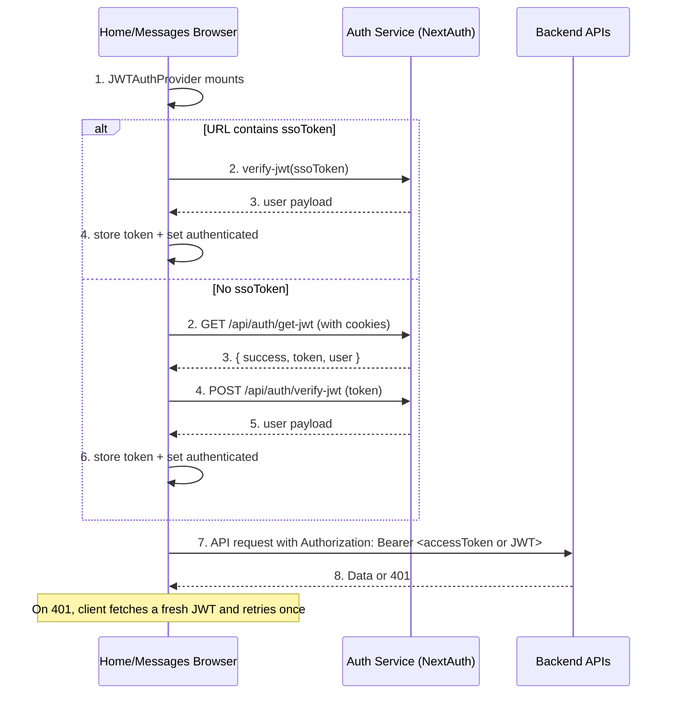
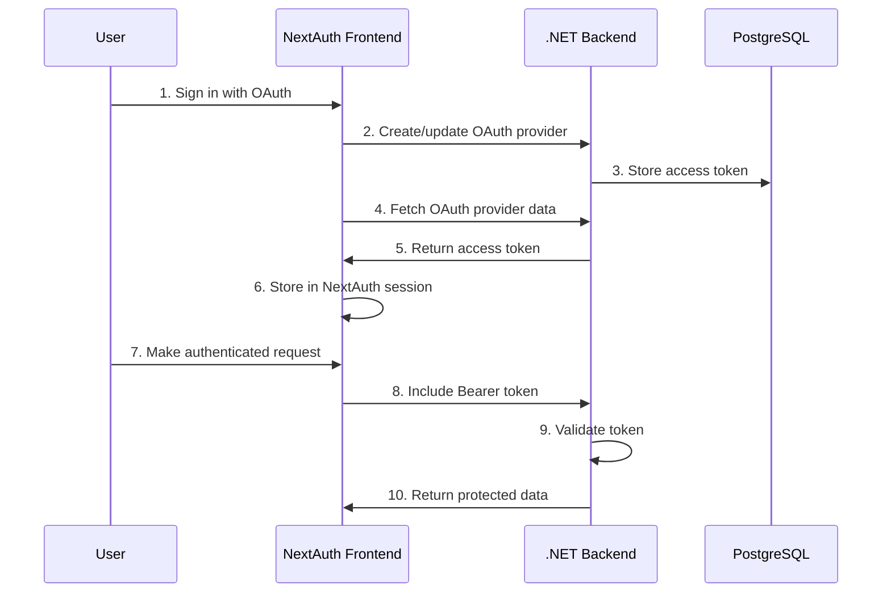

## 🔐 JWT-based Stateless Authentication (Current)

This is the current, production-ready authentication model. It removes all server-side user injection and relies on stateless JWTs issued by the `auth-user-service` (NextAuth) and verified by consumer services.

### Key points
- ✅ Centralized login with NextAuth in `auth-user-service`
- ✅ Stateless JWTs: no per-service server session or injected global state
- ✅ Seamless auto-login using `GET /api/auth/get-jwt` (uses browser cookies)
- ✅ Token verification using `POST /api/auth/verify-jwt`
- ✅ Frontend-only session state via `JWTAuthProvider` (local/session storage)
- ✅ Authenticated API calls with Bearer token; automatic retry on 401
- ✅ Seamless cascade logout across all services via `auto-signout` → `cascade-signout` → `/signing-out` (shows app Loader)

### High-level flow



### Auth service endpoints
- `GET /api/auth/get-jwt`
  - Uses NextAuth cookies (credentials: include) to issue a short-lived JWT
  - Returns `{ success, token, user }`

- `POST /api/auth/verify-jwt`
  - Body: `{ token }`
  - Verifies JWT signature and returns `{ success, user }`

- `POST /api/auth/auto-signout?callbackUrl=<origin>`
  - Clears NextAuth cookies
  - If called directly from Auth (callback equals Auth origin): 302 to `/signing-out?services=...&return=<origin>`
  - If called from a frontend: returns `{ success, cascadeUrl }` that points to `GET /api/auth/cascade-signout`

- `GET /api/auth/cascade-signout?services=<csv>&return=<url>`
  - Convenience endpoint that redirects to the client page `/signing-out` with the same parameters
  - Use this from frontends after `auto-signout`

- `GET /signing-out?services=<csv>&return=<url>`
  - Client page that renders the app Loader (`LoadingOverlay`) and performs hidden-iframe signouts to each service by navigating to `<service>?signout=1`
  - When finished, redirects to `return` URL with `?signout=1`

### Frontend authentication (consumer services)
- `JWTAuthProvider` (Home/Messages)
  - Reads `ssoToken` from URL and logs in if present
  - Otherwise attempts silent login via `GET /api/auth/get-jwt`
  - Verifies and stores the token in localStorage/sessionStorage
  - Exposes state via `useAuth`: `{ isAuthenticated, user, loading, login, logout, refreshAuth }`
  - Periodically calls `refreshAuth` to keep the session valid

- `UserProvider`
  - Hydrates UI immediately from `useAuth().currentUser`
  - Optionally refetches full profile from backend by email

- Signout handling in the browser
  - Each service includes a lightweight `SignoutHandler` that, on load, checks for `?signout=1`, clears `jwt_auth_token` from storage, and removes the query param from the URL.
  - The Auth service layout also includes a `SignoutHandler` to ensure any residual cookies/params are tidied up on completion of cascade.

### Authenticated API client
- Reads `jwt_auth_token` from storage
- Prefers `accessToken` from the JWT payload as Bearer; falls back to the raw JWT
- On 401 responses, calls `GET /api/auth/get-jwt` and retries once
- Never auto-redirects; lets UI handle unauthenticated states

### Environment variables
```
NEXT_PUBLIC_AUTH_USER_SERVICE=http://localhost:3000
NEXT_PUBLIC_HOME_PORTFOLIO_SERVICE=http://localhost:3001
NEXT_PUBLIC_MESSAGES_SERVICE=http://localhost:3002
NEXT_PUBLIC_ADMIN_SERVICE=http://localhost:3003
NEXT_PUBLIC_USER_API_URL=http://localhost:5200
NEXT_PUBLIC_PORTFOLIO_API_URL=http://localhost:5201
NEXT_PUBLIC_MESSAGES_API_URL=http://localhost:5093
```

Notes:
- JWT secret consistency: all JWT issue/verify endpoints in Auth use `process.env.AUTH_SECRET || process.env.NEXTAUTH_SECRET`. Ensure the chosen secret is identical across all Auth instances to avoid signature verification failures.
- Cascade signout requires absolute origins for services: set `NEXT_PUBLIC_HOME_PORTFOLIO_SERVICE` and `NEXT_PUBLIC_MESSAGES_SERVICE` to the public origins of each app (local and prod).

### What was the problem and how it was solved

- Problem
  - Global user injection in consumer services used process-level Maps and `/api/user/get` with "first entry" fallback. This caused cross-user contamination (users appeared logged-in across different devices/browsers).
  - Server-to-server injection couldn't set browser cookies; cross-origin cookie behavior resulted in 401s and brittle silent-SSO redirect flows that disrupted UX.
  - Legacy polling/grace timers and redirect loops caused infinite loading and delayed rendering.

- Solution
  - Removed all server-side injection and related endpoints in consumer services.
  - Switched to stateless JWTs issued by `auth-user-service` and verified via `POST /api/auth/verify-jwt` using `jose`.
  - Implemented `JWTAuthProvider` to handle SSO token login, silent auto-login via `GET /api/auth/get-jwt` (with cookies), verification, storage, and refresh.
  - Updated `authenticatedClient` to send Bearer tokens (prefer `accessToken` from JWT payload), retry once on 401 via a fresh JWT fetch, and never auto-redirect.
  - `UserProvider` hydrates UI immediately from the JWT user and optionally refetches profile.
  - Seamless cascade logout: frontends call `auto-signout` to clear NextAuth cookies, then navigate to `cascade-signout`/`/signing-out` which sequentially visits each service with `?signout=1` and finally returns to the initiating origin with `?signout=1` so local tokens are cleared everywhere.
  - Standardized JWT secrets across `get-jwt`, `verify-jwt`, and `sso/callback` to prevent signature mismatches.
  - Removed artificial delays/grace periods; added SSR guards and appropriate CORS.

- Impact
  - Per-device session isolation; no shared process/global state.
  - Faster, seamless UX: instant header hydration, no forced redirects for unauthenticated users.
  - Operational simplicity: no cross-service injection or cookie forwarding; fully token-based.

### Removed legacy endpoints (no longer used)
- other-services: `/api/user/inject`, `/api/user/inject-client`, `/api/user/get`, `/api/user/remove`
- other-services: `/api/auth/silent-sso`, `/api/auth/local-logout`, debug token routes
- auth-user-service: all server-to-server user injection calls

## 🏃‍♂️ Automatic User Detection

### Periodic User Injection Detection
```javascript
// All services automatically detect injected users
useEffect(() => {
  // Check for injected user data every 15 seconds
  const intervalId = setInterval(() => {
    if (!isAuthenticated) {
      checkAuthentication(); // Checks /api/user/get endpoint
    }
  }, 15000);
  
  return () => clearInterval(intervalId);
}, [isAuthenticated]);
```

### User Data Retrieval
```javascript
// other-services/app/api/user/get/route.ts
export async function GET() {
  // Check if user data was injected by auth service
  if (global.serviceUserStorage.size === 0) {
    return NextResponse.json({ error: 'No user data found' }, { status: 404 });
  }
  
  // Return injected user data
  const userData = Array.from(global.serviceUserStorage.values())[0];
  return NextResponse.json(userData);
}
```

## 🔒 OAuth 2.0 Secure Endpoints Implementation

### Backend Security Architecture

The backend APIs are now secured using OAuth 2.0 Bearer tokens with the following components:

#### 1. OAuth 2.0 Middleware
```csharp
// backend/backend-user/Middleware/OAuth2Middleware.cs
public async Task InvokeAsync(HttpContext context, IOAuth2Service oauth2Service)
{
    // Extract Bearer token from Authorization header
    var authHeader = context.Request.Headers["Authorization"].FirstOrDefault();
    if (string.IsNullOrEmpty(authHeader) || !authHeader.StartsWith("Bearer "))
    {
        context.Response.StatusCode = 401;
        await context.Response.WriteAsync("Unauthorized: No valid token provided");
        return;
    }

    var token = authHeader.Substring("Bearer ".Length);
    
    // Validate token with OAuth2Service
    var oauthProvider = await oauth2Service.ValidateAccessTokenAsync(token);
    if (oauthProvider == null)
    {
        context.Response.StatusCode = 401;
        await context.Response.WriteAsync("Unauthorized: Invalid token");
        return;
    }

    // Add user context to request
    context.Items["User"] = await oauth2Service.GetUserByAccessTokenAsync(token);
    await _next(context);
}
```

#### 2. OAuth 2.0 Service Implementation
```csharp
// backend/backend-user/Services/OAuth2Service.cs
public class OAuth2Service : IOAuth2Service
{
    public async Task<OAuthProvider?> ValidateAccessTokenAsync(string token)
    {
        // Find OAuth provider by access token
        return await _oauthProviderRepository.GetByAccessTokenAsync(token);
    }

    public async Task<User?> GetUserByAccessTokenAsync(string token)
    {
        var oauthProvider = await ValidateAccessTokenAsync(token);
        if (oauthProvider == null) return null;
        
        return await _userRepository.GetByIdAsync(oauthProvider.UserId);
    }

    public async Task<bool> RefreshAccessTokenAsync(string refreshToken)
    {
        // Implement token refresh logic
        var oauthProvider = await _oauthProviderRepository.GetByRefreshTokenAsync(refreshToken);
        if (oauthProvider == null) return false;
        
        // Refresh token logic here
        return true;
    }
}
```

#### 3. Frontend Authenticated API Client
```typescript
// frontend/auth-user-service/lib/api/authenticated-client.ts
export class AuthenticatedApiClient {
  static async request<T>(
    endpoint: string,
    options: ApiClientOptions = {}
  ): Promise<T> {
    const { method = 'GET', body, headers, requireAuth = true } = options

    const requestHeaders: Record<string, string> = {
      'Content-Type': 'application/json',
      ...headers,
    }

    // Add OAuth 2.0 Bearer token if required
    if (requireAuth) {
      const session = await getSession()
      if (session?.accessToken) {
        requestHeaders['Authorization'] = `Bearer ${session.accessToken}`
      } else {
        throw new Error('No access token available. Please sign in.')
      }
    }

    const response = await fetch(`${AuthenticatedApiClient.baseUrl}${endpoint}`, config)
    
    if (!response.ok) {
      if (response.status === 401) {
        throw new Error('Unauthorized: Please sign in again')
      }
      // Handle other errors...
    }

    return await response.json();
  }
}
```

#### 4. NextAuth Integration with OAuth 2.0
```typescript
// frontend/auth-user-service/lib/auth/auth-options.ts
async jwt({ token, account, user }) {
  if (account && user) {
    try {
      const userData = await getUserByEmail(user.email!);
      if (userData) {
        // Fetch OAuth provider access token from backend
        const backendUrl = process.env.NEXT_PUBLIC_USER_API_URL || 'http://localhost:5200';
        const url = `${backendUrl}/api/users/${userData.id}/oauth-providers/${getProviderNumber(account.provider)}`;
        
        const response = await fetch(url, {
          method: 'GET',
          headers: { 'Content-Type': 'application/json' },
        });
        
        if (response.ok) {
          const oauthData = await response.json();
          if (oauthData.exists && oauthData.provider) {
            token.accessToken = oauthData.provider.accessToken;
            token.userId = userData.id;
          }
        }
      }
    } catch (error) {
      console.error('Error fetching OAuth access token:', error);
    }
  }
  return token;
}
```

### Protected Endpoints

The following endpoints are now secured with OAuth 2.0 Bearer tokens:

#### Backend User Service (Port 5200)
- ✅ `GET /api/users/{id}` - Get user profile
- ✅ `PUT /api/users/{id}` - Update user profile
- ✅ `GET /api/users/{id}/oauth-providers` - Get user OAuth providers
- ✅ `POST /api/users/{id}/oauth-providers` - Add OAuth provider
- ✅ `DELETE /api/users/{id}/oauth-providers/{providerId}` - Remove OAuth provider
- ✅ `PUT /api/users/{id}/oauth-providers/{providerId}` - Update OAuth provider

#### Unauthenticated Endpoints (During Auth Flow)
- ✅ `POST /api/users/login` - User login
- ✅ `POST /api/users/register` - User registration
- ✅ `GET /api/users/check-email` - Check email availability
- ✅ `GET /api/users/oauth-providers/check` - Check OAuth provider
- ✅ `GET /api/users/email/{email}` - Get user by email (during auth)
- ✅ `GET /api/users/{userId}/oauth-providers/{providerId}` - Get OAuth provider (during auth)

### OAuth 2.0 Token Flow



### Database Schema

The OAuth 2.0 implementation uses the existing `oauth_providers` table:

```sql
-- Existing oauth_providers table structure
CREATE TABLE oauth_providers (
    id UUID PRIMARY KEY DEFAULT gen_random_uuid(),
    user_id UUID NOT NULL REFERENCES users(id) ON DELETE CASCADE,
    provider OAuthProviderType NOT NULL, -- 0=Google, 1=GitHub, 2=LinkedIn, 3=Facebook
    provider_id VARCHAR(255) NOT NULL,
    provider_email VARCHAR(255) NOT NULL,
    access_token TEXT NOT NULL,           -- 🔥 OAuth 2.0 access token
    refresh_token TEXT,                   -- 🔥 OAuth 2.0 refresh token
    token_expires_at TIMESTAMP,
    created_at TIMESTAMP DEFAULT NOW(),
    updated_at TIMESTAMP DEFAULT NOW()
);
```

### Security Features

- ✅ **Bearer Token Authentication** - All protected endpoints require valid OAuth 2.0 tokens
- ✅ **Token Validation** - Backend validates tokens against database
- ✅ **Automatic Token Injection** - Frontend automatically includes tokens in requests
- ✅ **Unauthorized Handling** - Proper 401 responses for invalid tokens
- ✅ **Session Integration** - Tokens stored in NextAuth session
- ✅ **Cross-Service Security** - All backend APIs can be secured with same pattern

## 📁 Complete File Structure

### Auth-User-Service (Primary Authentication)
```
auth-user-service/
├── lib/auth/
│   ├── auth-options.ts              # Enhanced NextAuth with OAuth 2.0
│   ├── custom-signout.ts            # Comprehensive logout
│   └── sso-auth.ts                  # Cross-service utilities
├── lib/api/
│   ├── authenticated-client.ts       # 🔥 OAuth 2.0 API client
│   └── user/api.ts                  # Updated with OAuth 2.0
├── lib/services/
│   └── user-injection-service.ts    # Service communication
├── lib/hooks/
│   ├── use-cross-service-auth.ts    # Cross-service detection
│   └── use-oauth-session.ts         # 🔥 OAuth session hook
├── app/api/
│   ├── services/user-injection/route.ts    # Central injection API
│   ├── auth/
│   │   ├── signout-all/route.ts            # Universal logout
│   │   └── check-signout-signal/route.ts   # Signal monitoring
│   ├── sso/callback/route.ts               # SSO handler
│   └── user/remove/route.ts                # Self cleanup
└── components/
    ├── providers.tsx                       # All providers
    ├── cross-service-auth-provider.tsx     # Cross-service detection
    └── auth-signout-monitor.tsx            # NextAuth cleanup
```

### Backend User Service (OAuth 2.0 Security)
```
backend-user/
├── Services/
│   ├── OAuth2Service.cs             # 🔥 OAuth 2.0 token validation
│   ├── Abstractions/
│   │   └── IOAuth2Service.cs        # 🔥 OAuth 2.0 interface
│   └── Mappers/
│       └── OAuthProviderMapper.cs   # 🔥 Updated with AccessToken
├── Middleware/
│   └── OAuth2Middleware.cs          # 🔥 OAuth 2.0 Bearer auth
├── Controllers/
│   └── OAuth2Controller.cs          # 🔥 OAuth 2.0 endpoints
├── DTO/
│   └── OAuthProvider/Response/
│       └── OAuthProviderResponseDto.cs # 🔥 Updated with tokens
├── Repositories/
│   ├── IOAuthProviderRepository.cs  # 🔥 Updated with token methods
│   └── OAuthProviderRepository.cs   # 🔥 Token lookup methods
└── Data/
    └── UserDbContext.cs             # Entity Framework setup
```

### Other Services (Admin, Home-Portfolio, Messages)
```
service/
├── lib/
│   ├── auth/sso-auth.ts             # JWT verification & sessions
│   └── contexts/
│       ├── auth-context.tsx         # Custom authentication
│       └── user-context.tsx         # User data management
├── app/api/user/
│   ├── inject/route.ts              # Receives user data
│   ├── remove/route.ts              # Removes user data
│   ├── get/route.ts                 # Local user access
│   └── auth/verify-sso/route.ts     # Server-side JWT verification
├── components/
│   ├── providers.tsx                # AuthProvider setup
│   └── header.tsx                   # Login/logout UI
└── middleware.ts                    # Request handling
```

## 🔒 Security Implementation

### JWT Token Security
```javascript
// 5-minute expiration for security
const token = await new SignJWT(payload)
  .setProtectedHeader({ alg: 'HS256' })
  .setExpirationTime('5m')
  .sign(secret);
```

### Service-to-Service Authentication
```javascript
// All inter-service calls use authentication header
headers: {
  'X-Service-Auth': process.env.SERVICE_AUTH_SECRET,
  'Content-Type': 'application/json'
}
```

### Session Management
```javascript
// Local sessions with 24-hour expiration
const sessionData = {
  email: user.email,
  userId: user.id,
  timestamp: Date.now(),
  expires: Date.now() + (24 * 60 * 60 * 1000) // 24 hours
};
```

## 🔧 Environment Configuration

### Required Variables (All Services)
```env
# JWT & Service Authentication
AUTH_SECRET=your-jwt-secret-key-here
SERVICE_AUTH_SECRET=your-service-auth-secret-here

# Service URLs
NEXT_PUBLIC_AUTH_USER_SERVICE=http://localhost:3000
NEXT_PUBLIC_HOME_PORTFOLIO_SERVICE=http://localhost:3001
NEXT_PUBLIC_MESSAGES_SERVICE=http://localhost:3002
NEXT_PUBLIC_ADMIN_SERVICE=http://localhost:3003

# Backend API URLs (OAuth 2.0 Secure Endpoints)
NEXT_PUBLIC_USER_API_URL=http://localhost:5200
NEXT_PUBLIC_PORTFOLIO_API_URL=http://localhost:5201
NEXT_PUBLIC_MESSAGES_API_URL=http://localhost:5093

# OAuth Credentials (Auth Service Only)
AUTH_GITHUB_ID=your-github-oauth-id
AUTH_GITHUB_SECRET=your-github-oauth-secret
AUTH_GOOGLE_ID=your-google-oauth-id
AUTH_GOOGLE_SECRET=your-google-oauth-secret
AUTH_FACEBOOK_ID=your-facebook-oauth-id
AUTH_FACEBOOK_SECRET=your-facebook-oauth-secret
AUTH_LINKEDIN_ID=your-linkedin-oauth-id
AUTH_LINKEDIN_SECRET=your-linkedin-oauth-secret

# NextAuth Configuration (Auth Service Only)
NEXTAUTH_URL=http://localhost:3000
NEXTAUTH_SECRET=your-nextauth-secret-key-here
```

