# 🔐 Complete Centralized SSO Authentication & User Injection System

This documentation covers the comprehensive Single Sign-On (SSO) authentication system with automatic user injection and cross-service logout capabilities implemented across all microservices.

## ✨ System Overview

**What This System Provides:**
- ✅ **Centralized Authentication** - Only `auth-user-service` handles OAuth login
- ✅ **Automatic User Injection** - User data automatically pushed to all services on login
- ✅ **Real-time Cross-Service Logout** - Logout from any service affects all services
- ✅ **Persistent Sessions** - Users stay logged in across service visits
- ✅ **Zero CORS Issues** - JWT token-based communication
- ✅ **Fault Tolerance** - Works even if some services are down

## 🏗️ Architecture

### Authentication Flow Components

```
┌─────────────────┐    ┌───────────────────┐    ┌──────────────────┐
│  Auth Service   │    │  Other Services   │    │   All Services   │
│   (Port 3000)   │    │ (Ports 3001-3003) │    │   (In-Memory)    │
├─────────────────┤    ├───────────────────┤    ├──────────────────┤
│ NextAuth Setup  │───▶│ Custom AuthContext│───▶│ User Data Storage│
│ OAuth Providers │    │ JWT Verification  │    │ Cross-Tab Sync   │
│ User Injection  │    │ SSO Token Handling│    │ Logout Detection │
│ Session Management│  │ Local Sessions    │    │ Real-time Updates│
└─────────────────┘    └───────────────────┘    └──────────────────┘
```

## 🔄 Complete Login Flow

### Step-by-Step Process

```mermaid
sequenceDiagram
    participant User
    participant AdminService as Admin Service (3003)
    participant AuthService as Auth Service (3000)
    participant AllServices as All Services

    User->>AdminService: 1. Visit admin-service
    AdminService->>AdminService: 2. Check local session
    AdminService->>AdminService: 3. Check injected user data
    AdminService->>AuthService: 4. Redirect to SSO callback
    AuthService->>AuthService: 5. Check NextAuth session
    AuthService->>User: 6. Redirect to OAuth login
    User->>AuthService: 7. Complete OAuth login
    AuthService->>AllServices: 8. Inject user data to ALL services
    AuthService->>AllServices: 9. Create JWT token
    AuthService->>AdminService: 10. Redirect with JWT token
    AdminService->>AdminService: 11. Verify JWT & create local session
    AdminService->>User: 12. User logged in successfully
```



### 1. Initial Visit
```javascript
// User visits any service (e.g., admin-service on port 3003)
// AuthContext checks authentication state
const checkAuthentication = async () => {
  // 1. Check for SSO token in URL
  // 2. Check local session storage
  // 3. Check injected user data from auth service
  // 4. If none found, redirect to auth service
}
```

### 2. Auth Service Redirect
```javascript
// Redirect to auth service SSO callback
const redirectToAuth = () => {
  const currentUrl = window.location.href;
  window.location.href = `${authServiceUrl}/api/sso/callback?callbackUrl=${currentUrl}`;
}
```

### 3. OAuth Authentication
```javascript
// In auth-user-service/lib/auth/auth-options.ts
async signIn({ user, account }) {
  // Verify OAuth provider
  // Check if user exists
  // On successful login:
  const userData = await getUserByEmail(user.email);
  await UserInjectionService.injectUser(userData); // 🔥 NEW: Immediate injection
  return true;
}
```

### 4. User Injection Process
```javascript
// auth-user-service/lib/services/user-injection-service.ts
static async injectUser(user: User) {
  const services = [
    'ADMIN_SERVICE',
    'HOME_PORTFOLIO_SERVICE', 
    'MESSAGES_SERVICE'
  ];
  
  // Inject user data to all services simultaneously
  await Promise.allSettled(
    services.map(service => 
      fetch(`${service.url}/api/user/inject`, {
        method: 'POST',
        headers: { 'X-Service-Auth': SERVICE_AUTH_SECRET },
        body: JSON.stringify(userData)
      })
    )
  );
}
```

### 5. JWT Token Creation & Redirect
```javascript
// auth-user-service/app/api/sso/callback/route.ts
// Create JWT token and redirect back to originating service
const token = await new SignJWT({ 
  email: userData.email,
  userId: userData.id,
  timestamp: Date.now()
}).setExpirationTime('5m').sign(secret);

return NextResponse.redirect(`${callbackUrl}?ssoToken=${token}`);
```

### 6. Local Session Creation
```javascript
// other-services/lib/contexts/auth-context.tsx
if (ssoToken) {
  const tokenPayload = await verifySSOToken(ssoToken);
  await createLocalSession(tokenPayload);
  setIsAuthenticated(true);
  
  // Also check for injected data
  const response = await fetch('/api/user/get');
  if (response.ok) {
    const userData = await response.json();
    setUser(userData);
  }
}
```

## 🚪 Complete Logout Flow

### Universal Logout System


### 1. Logout Initiation (Any Service)
```javascript
// other-services/lib/contexts/auth-context.tsx
const logout = async () => {
  // Clear local state immediately
  setIsAuthenticated(false);
  setUserEmail(null);
  setUserId(null);
  
  // Call comprehensive logout
  await logoutFromAllServices();
};
```

### 2. Cross-Service Logout Call
```javascript
// other-services/lib/auth/sso-auth.ts
export async function logoutFromAllServices() {
  try {
    // Call auth service to remove user from all services
    const response = await fetch(`${authServiceUrl}/api/auth/signout-all`, {
      method: 'POST',
      credentials: 'include',
    });
    
    // Trigger cross-service logout signal
    localStorage.removeItem('sso_session');
    
    // Redirect to auth service for complete logout
    window.location.href = `${authServiceUrl}/api/auth/signout`;
  } catch (error) {
    console.error('Logout error:', error);
  }
}
```

### 3. Auth Service Comprehensive Logout
```javascript
// auth-user-service/lib/auth/custom-signout.ts
export async function customSignOut() {
  // 1. Trigger cross-service logout signal
  triggerCrossServiceLogout();
  
  // 2. Remove user data from all services
  await fetch('/api/auth/signout-all', { method: 'POST' });
  
  // 3. NextAuth signout
  await signOut({ callbackUrl: '/', redirect: true });
}
```

### 4. User Data Removal
```javascript
// auth-user-service/app/api/services/user-injection/route.ts
async function removeUserFromServices(userEmail) {
  const services = [
    'AUTH_USER_SERVICE',    // 🔥 NEW: Include auth service
    'ADMIN_SERVICE',
    'HOME_PORTFOLIO_SERVICE',
    'MESSAGES_SERVICE'
  ];
  
  // Remove user from all services
  await Promise.allSettled(
    services.map(service => 
      fetch(`${service.url}/api/user/remove`, {
        method: 'DELETE',
        headers: { 'X-Service-Auth': SERVICE_AUTH_SECRET },
        body: JSON.stringify({ email: userEmail })
      })
    )
  );
}
```

### 5. Cross-Tab Logout Synchronization
```javascript
// All services monitor localStorage changes
useEffect(() => {
  const handleStorageChange = (event) => {
    if (event.key === 'sso_session' && event.newValue === null) {
      // Another tab/service logged out, sync immediately
      setIsAuthenticated(false);
      setUserEmail(null);
      setUserId(null);
    }
  };
  
  window.addEventListener('storage', handleStorageChange);
  return () => window.removeEventListener('storage', handleStorageChange);
}, []);
```

### 6. NextAuth Session Cleanup
```javascript
// auth-user-service/components/auth-signout-monitor.tsx
// Monitors for logout signals and triggers NextAuth signOut
useEffect(() => {
  const checkSignoutSignal = async () => {
    const response = await fetch('/api/auth/check-signout-signal', {
      method: 'POST',
      body: JSON.stringify({ email: session.user.email })
    });
    
    if (response.ok) {
      const data = await response.json();
      if (data.shouldSignOut) {
        await signOut({ callbackUrl: '/', redirect: true });
      }
    }
  };
  
  // Check every 5 seconds
  const interval = setInterval(checkSignoutSignal, 5000);
  return () => clearInterval(interval);
}, []);
```

## 🏃‍♂️ Automatic User Detection

### Periodic User Injection Detection
```javascript
// All services automatically detect injected users
useEffect(() => {
  // Check for injected user data every 15 seconds
  const intervalId = setInterval(() => {
    if (!isAuthenticated) {
      checkAuthentication(); // Checks /api/user/get endpoint
    }
  }, 15000);
  
  return () => clearInterval(intervalId);
}, [isAuthenticated]);
```

### User Data Retrieval
```javascript
// other-services/app/api/user/get/route.ts
export async function GET() {
  // Check if user data was injected by auth service
  if (global.serviceUserStorage.size === 0) {
    return NextResponse.json({ error: 'No user data found' }, { status: 404 });
  }
  
  // Return injected user data
  const userData = Array.from(global.serviceUserStorage.values())[0];
  return NextResponse.json(userData);
}
```

## 📁 Complete File Structure

### Auth-User-Service (Primary Authentication)
```
auth-user-service/
├── lib/auth/
│   ├── auth-options.ts              # Enhanced NextAuth with injection
│   ├── custom-signout.ts            # Comprehensive logout
│   └── sso-auth.ts                  # Cross-service utilities
├── lib/services/
│   └── user-injection-service.ts    # Service communication
├── lib/hooks/
│   └── use-cross-service-auth.ts    # Cross-service detection
├── app/api/
│   ├── services/user-injection/route.ts    # Central injection API
│   ├── auth/
│   │   ├── signout-all/route.ts            # Universal logout
│   │   └── check-signout-signal/route.ts   # Signal monitoring
│   ├── sso/callback/route.ts               # SSO handler
│   └── user/remove/route.ts                # Self cleanup
└── components/
    ├── providers.tsx                       # All providers
    ├── cross-service-auth-provider.tsx     # Cross-service detection
    └── auth-signout-monitor.tsx            # NextAuth cleanup
```

### Other Services (Admin, Home-Portfolio, Messages)
```
service/
├── lib/
│   ├── auth/sso-auth.ts             # JWT verification & sessions
│   └── contexts/
│       ├── auth-context.tsx         # Custom authentication
│       └── user-context.tsx         # User data management
├── app/api/user/
│   ├── inject/route.ts              # Receives user data
│   ├── remove/route.ts              # Removes user data
│   ├── get/route.ts                 # Local user access
│   └── auth/verify-sso/route.ts     # Server-side JWT verification
├── components/
│   ├── providers.tsx                # AuthProvider setup
│   └── header.tsx                   # Login/logout UI
└── middleware.ts                    # Request handling
```

## 🔒 Security Implementation

### JWT Token Security
```javascript
// 5-minute expiration for security
const token = await new SignJWT(payload)
  .setProtectedHeader({ alg: 'HS256' })
  .setExpirationTime('5m')
  .sign(secret);
```

### Service-to-Service Authentication
```javascript
// All inter-service calls use authentication header
headers: {
  'X-Service-Auth': process.env.SERVICE_AUTH_SECRET,
  'Content-Type': 'application/json'
}
```

### Session Management
```javascript
// Local sessions with 24-hour expiration
const sessionData = {
  email: user.email,
  userId: user.id,
  timestamp: Date.now(),
  expires: Date.now() + (24 * 60 * 60 * 1000) // 24 hours
};
```

## 🔧 Environment Configuration

### Required Variables (All Services)
```env
# JWT & Service Authentication
AUTH_SECRET=your-jwt-secret-key-here
SERVICE_AUTH_SECRET=your-service-auth-secret-here

# Service URLs
NEXT_PUBLIC_AUTH_USER_SERVICE=http://localhost:3000
NEXT_PUBLIC_HOME_PORTFOLIO_SERVICE=http://localhost:3001
NEXT_PUBLIC_MESSAGES_SERVICE=http://localhost:3002
NEXT_PUBLIC_ADMIN_SERVICE=http://localhost:3003

# Backend API URLs
NEXT_PUBLIC_USER_API_URL=http://localhost:5200
NEXT_PUBLIC_PORTFOLIO_API_URL=http://localhost:5201
NEXT_PUBLIC_MESSAGES_API_URL=http://localhost:5093

# OAuth Credentials (Auth Service Only)
AUTH_GITHUB_ID=your-github-oauth-id
AUTH_GITHUB_SECRET=your-github-oauth-secret
AUTH_GOOGLE_ID=your-google-oauth-id
AUTH_GOOGLE_SECRET=your-google-oauth-secret

# NextAuth Configuration (Auth Service Only)
NEXTAUTH_URL=http://localhost:3000
```

